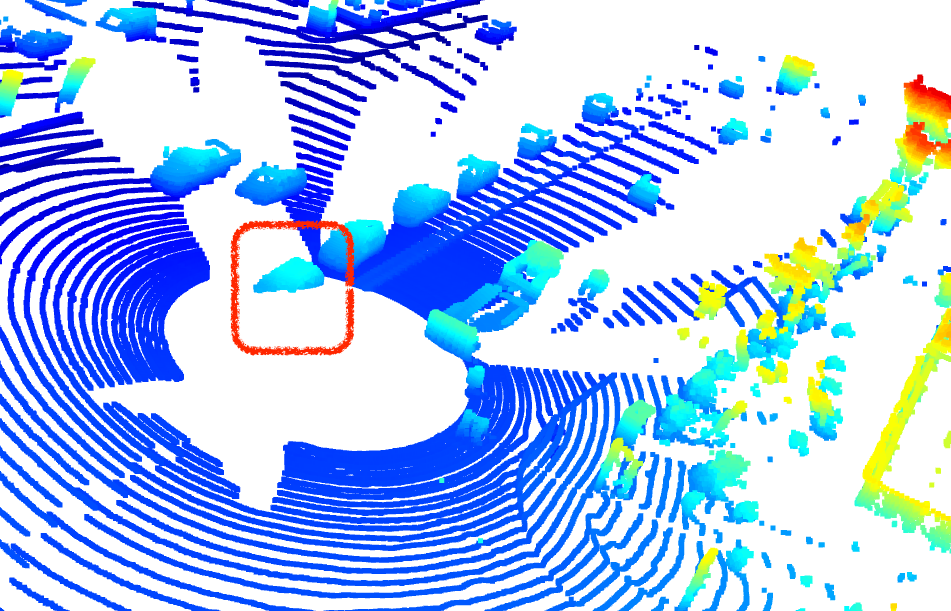

# ID_S1_EX2 exercise writeup

## 6 examples of vehicles 
Find and display 6 examples of vehicles with varying degrees of visibility in the point-cloud

### 1: regular car very visible incl sidemirrors

 

### 2: pickup truck with trailer

### 3: clearly a car despite occlusions

### 4: probably car but hard to say

### 5: probably a car but few features

### 6: mini van with large window high roof

### 7: vehicle which seems maybe parked

### 8: Vehicle very close to ego / ourselves

### 9: possibly a pedestrian, very close by

### 10: potentially occluded unseen vehicles

## Identify vehicle features
Identify vehicle features that appear as a stable feature on most vehicles (e.g. rear-bumper, tail-lights) and describe them briefly. Also, use the range image viewer from the last example to underpin your findings using the lidar intensity channel.

### Front Grill & Bumber
many points reflected from the front grille bumber area.

### Back Bumber
Also a big area from the back of the car incl bumber. High intensity.

### Side mirrors are sometimes also clearly seen
depending on the angle, side mirrors are clearly visible and a good distinguishing feature

### Wheels
also depends on angle, but can sometimes be clearly seen as a distinguishing feature.

### Windows often clearly visible
