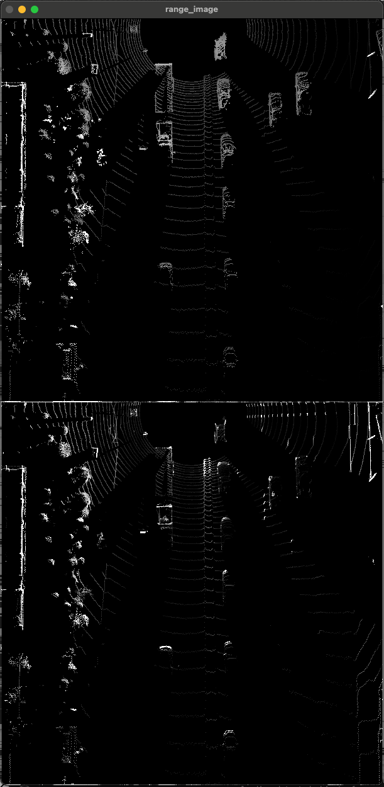
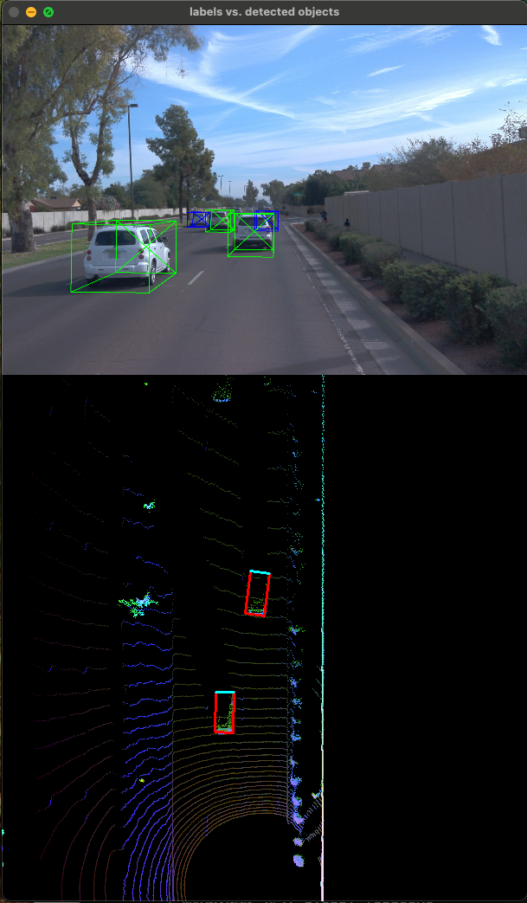
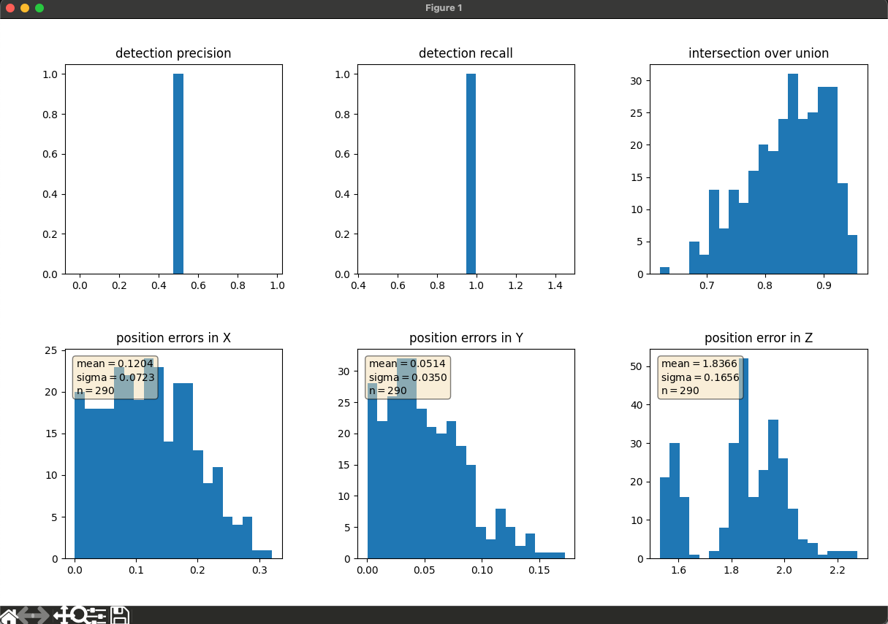
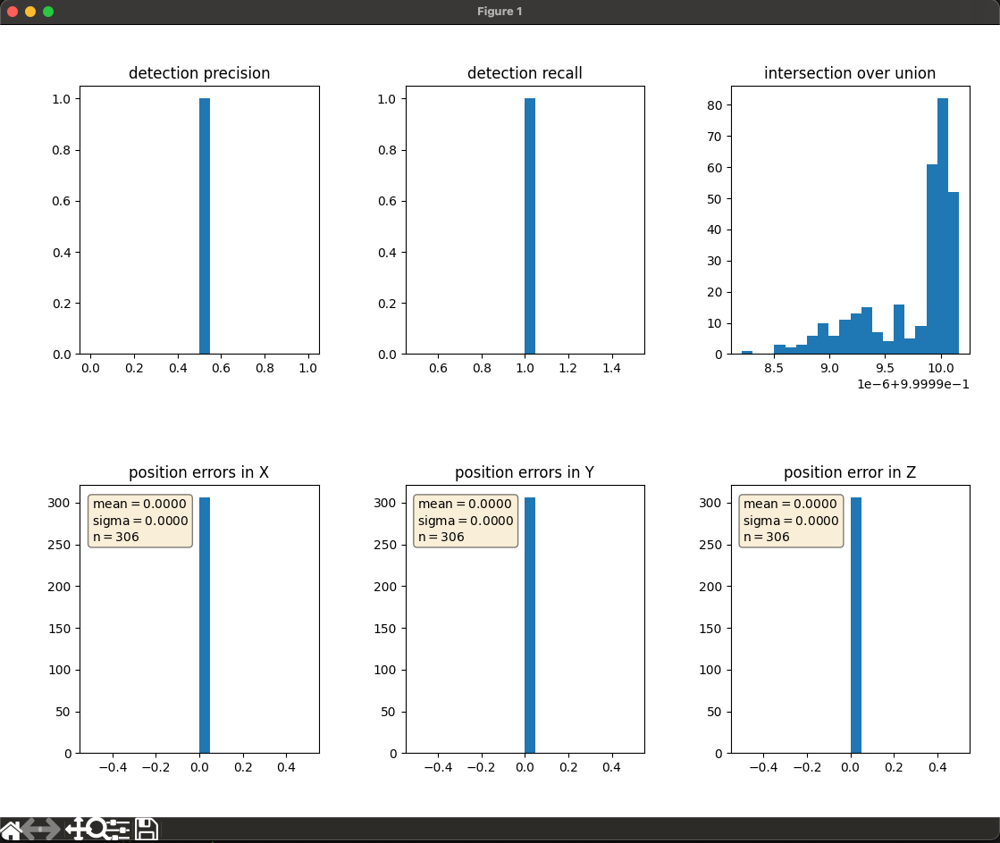

# Visualize range image channels (ID_S1_EX1)

- Done

# Visualize point-cloud (ID_S1_EX2)

- Done
- Write-up is here:

[ID_S1_EX2](ID_S1_EX2/ID_S1_EX2.md)

# Convert sensor coordinates to bev-map coordinates (ID_S2_EX1)

- Done

# Compute intensity layer of bev-map (ID_S2_EX2)

- Done

# Compute height layer of bev-map (ID_S2_EX3)

- Done

# Add a second model from a GitHub repo (ID_S3_EX1)

- Done
- 

# Compute intersection-over-union (IOU) between labels and detections (ID_S4_EX1)

- Done

# Compute false-negatives and false-positives (ID_S4_EX2)

- Done

# Compute precision and recall (ID_S4_EX3)

- Done
- 
- 
