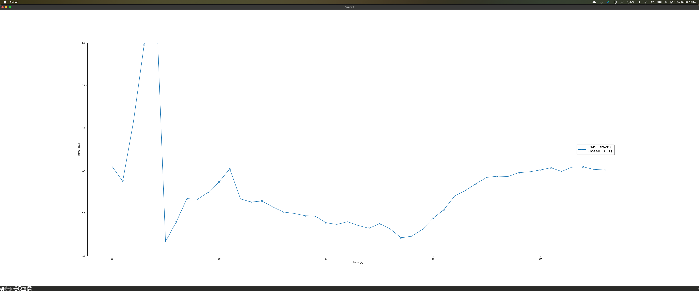
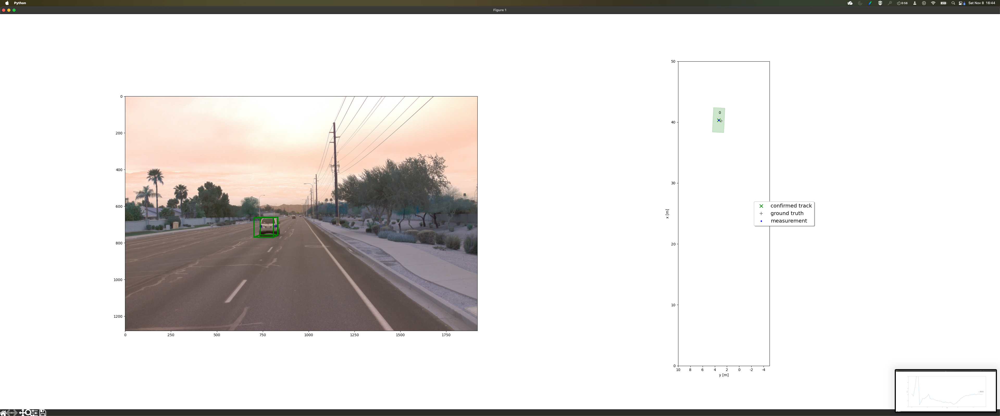
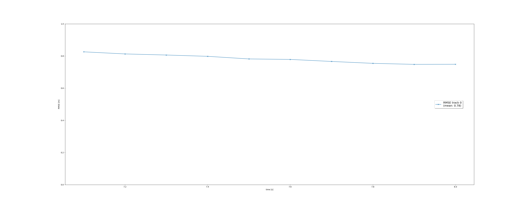
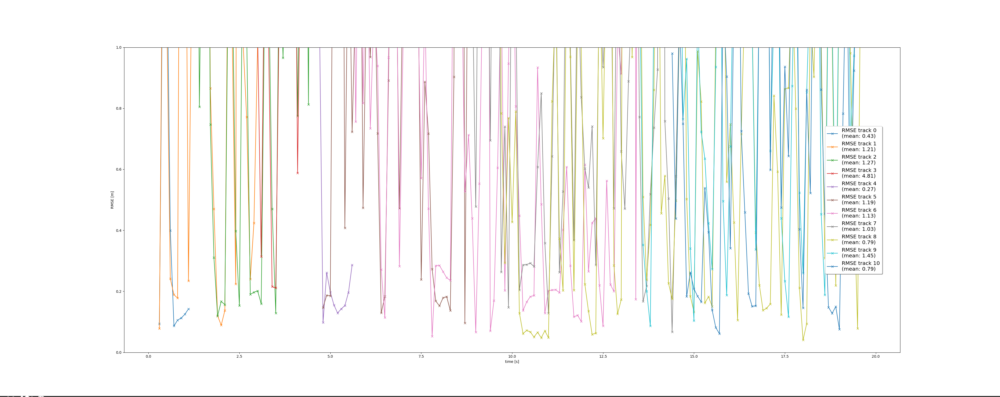
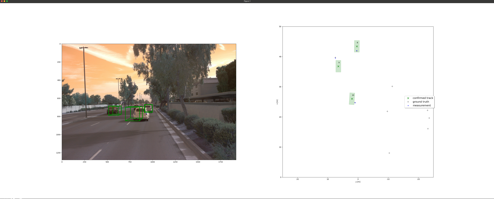

# submission. full project

# Tracking
> Track objects over time with a Kalman Filter

mean RMSE is 0.31
Image: 
Track: 

# Track Management
> Initialize, update and delete tracks

Please upload the RMSE plot as png or pdf file.

Mean RSME: 0.78
Image: 

# Data Association
> Associate measurements to tracks with nearest neighbor association

Please upload the RMSE plot as png or pdf file.

Total tracks: 10
RSME: 
End frame: 

