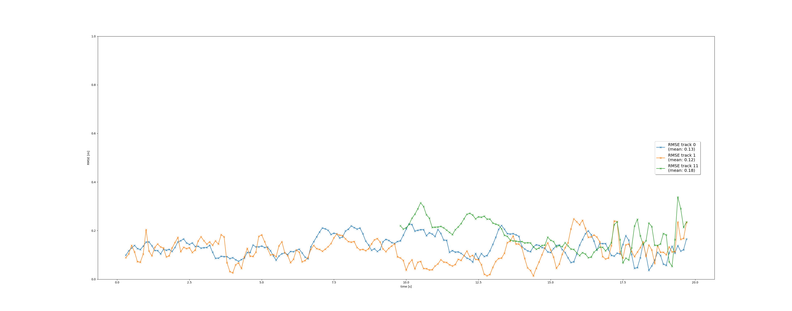
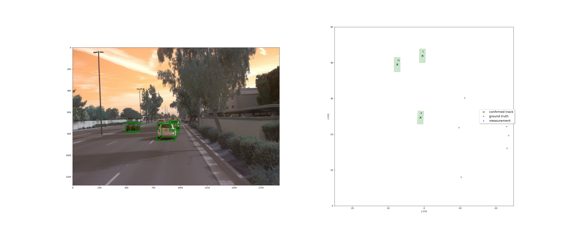

# Submission. Fusion Project.

## Write a short recap of the four tracking steps and what you implemented there (EKF, track management, data association, camera-lidar sensor fusion). Which results did you achieve? Which part of the project was most difficult for you to complete, and why?
- With EKF I was able to predict the likely next position of the trajectory.
- with track management I was able to initiative new tracks, update known track and remove tracks not relevant any more
- with association I could relate measurement and track, thereby deciding which tracks to increase in score and make a confirmed track.
- with camera+lidar senson fusion was able to confirm track with two different sensor modalities thereby increasing the robustness and safety

## Do you see any benefits in camera-lidar fusion compared to lidar-only tracking (in theory and in your concrete results)?
Camera and Lidar have different strenths and weaknesses, for example lidar works well in the dark - but camera can understand traffic signs and stop lights.

## Which challenges will a sensor fusion system face in real-life scenarios? Did you see any of these challenges in the project?
it can be challenging to keep track of multiple sensors which overlap each other, need to be calibrated very accurately and also have differerent characteristics.

## Can you think of ways to improve your tracking results in the future?
I would like to more quickly eliminate the tentative ghosts track, they seem to stick around for longer after I introduced fusion with camera.

# Tracking
> Track objects over time with a Kalman Filter

mean RMSE is 0.31
Image: 
Track: 

# Track Management
> Initialize, update and delete tracks

Please upload the RMSE plot as png or pdf file.

Mean RSME: 0.78
Image: 

# Data Association
> Associate measurements to tracks with nearest neighbor association

Please upload the RMSE plot as png or pdf file.

Total tracks: 10
RSME: 
End frame: 

# Sensor Fusion
> SWBAT fuse measurements from lidar and camera

Three stable tracks (track 0, 1, 11)

Video: <video controls src="Fusion Project Udacity Selfdriving Cars.mp4" title="video"></video>
RSME: 
End frame: 

